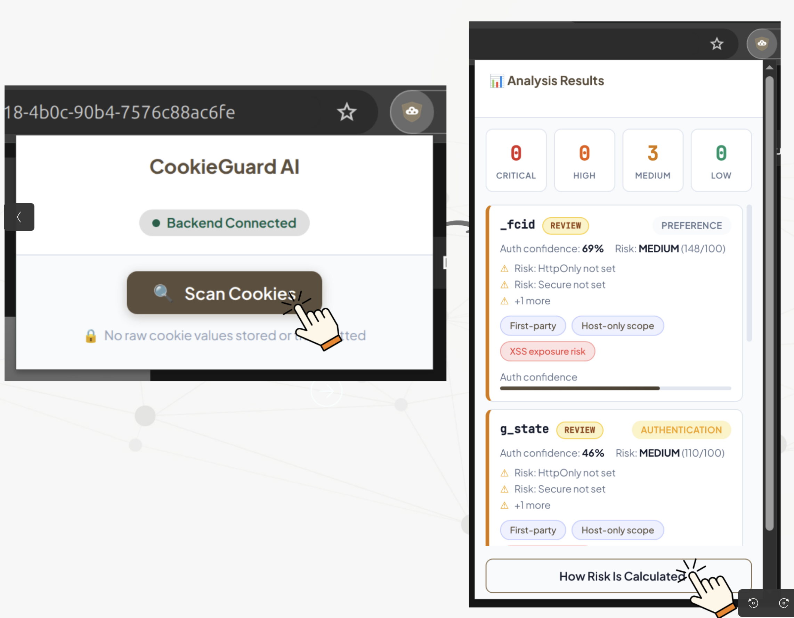
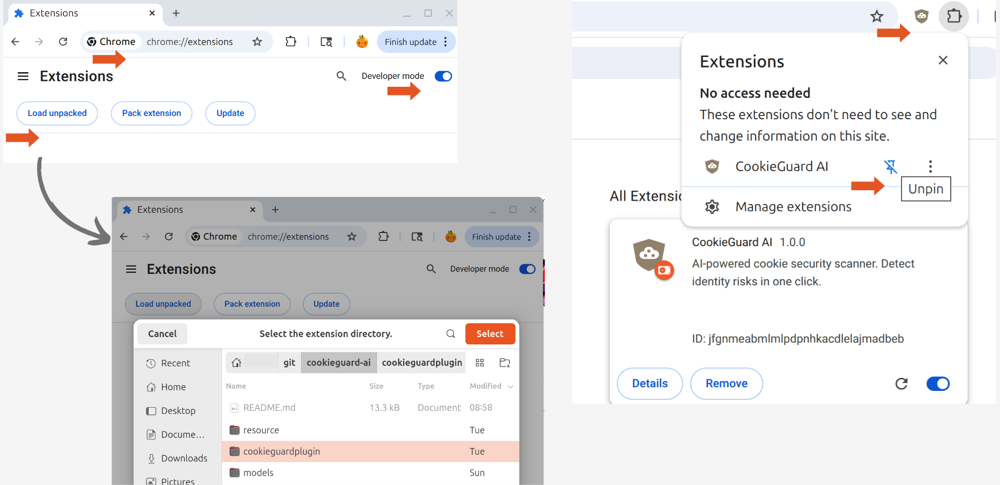

# CookieGuard AI

**Detecting Security-Critical Cookie Misuse That Puts Digital Identity at Risk**

An AI-powered web application that analyzes website cookies to detect security-related misuse that can lead to account takeover, unauthorized actions, and identity impersonation.

## Project Overview

CookieGuard AI uses machine learning and rule-based analysis to:
- Identify which cookies act as authentication tokens
- Score their security risk
- Explain in plain language how misconfigured cookies expose digital identity
##


## What's New in 2.0

| Feature | v1.0 | v2.0 |
|---------|------|------|
| Features | 18 | **38** (added behavior group) |
| Models | Random Forest only | **3 models benchmarked** (RF, LR, HistGBT) |
| Validation | Random split | **Site-based group holdout** |
| Explainability | Evidence chips | **Per-cookie "Why AI flagged this"** with risk formula breakdown |
| Attack simulation | — | **Per-cookie attack paths** with user-actionable fixes |
| Login detection | Basic before/after | **Behavior features**: changed, new, rotated at login |
| Recommendations | Server-side ("Set HttpOnly") | **User-actionable** ("Use a VPN", "Log out after sessions") |
| Model card | — | **model_card.json** with metrics, version, feature groups |


## Quick Start

### Prerequisites
- Python 3.8+
- Node.js 16+ (for frontend)
- pip and npm

## 🔧 Install Chrome Extension (Developer Mode)

CookieGuard AI is currently distributed via GitHub and can be loaded manually using Chrome’s Developer Mode.

---

### Step1: Download the Repository
**Option A — Clone via Git**
```bash
# Clone the repository
git clone git@github.com:aiscihub/cookieguard-ai.git
cd cookieguard-ai
```

**Option B — Download ZIP**
Go to the GitHub repository.
Click Code → Download ZIP.
Extract the ZIP file on your computer.

### Step 2: Locate the Extension Folder
Navigate to the folder that directly contains:
```bash
manifest.json
#in repo it is
cookieguard-ai/cookieguardplugin/
```

### Step3: Load the Extension
Open Chrome, and go to: **chrome://extensions/**

Toggle Developer mode (top-right corner).

Click **Load unpacked**.

Select the extension folder (cookieguard-ai/cookieguardplugin/).

Click Open.

### Step 4: Start the Backend
CookieGuard AI uses a local Python backend for AI-based risk analysis.
```bash
cd cookieguard-ai/backend
#If using conda
#conda create -n cookieguard python=3.10 -y
#conda activate cookieguard

# Install backend dependencies
pip install -r requirements.txt

# Train the ML model (first time only)
python backend/train_model.py

# Start the backend server
python backend/app.py
```
By default, the backend runs at:
```bash
http://localhost:5000
```


### Step 5:Run a Test Scan
Visit a website with login functionality.
Click the CookieGuard AI extension icon.
Click Scan Cookies.
Review classification and risk analysis results.

## Project Architecture

### System Overview

```
┌─────────────────────────────────────────────────────────────────┐
│                        CookieGuard AI                           │
│                    End-to-End Architecture                      │
└─────────────────────────────────────────────────────────────────┘

  ┌──────────────┐
  │   Browser    │ ──→ Cookie Export (JSON)
  └──────────────┘
         │
         ▼
  ┌──────────────────────────────────────────────────────────────┐
  │                   React                                      │
  │  • Results Visualization                                     │
  │  • Risk Dashboard                                            │
  └──────────────────────────────────────────────────────────────┘
         │ HTTP POST
         ▼
  ┌──────────────────────────────────────────────────────────────┐
  │                   Backend (Flask API)                        │
  │  • /api/analyze                                              │
  │  • /health                                                   │
  └──────────────────────────────────────────────────────────────┘
         │
         ▼
  ┌──────────────────────────────────────────────────────────────┐
  │              Analysis Pipeline (Python)                      │
  │                                                              │
  │  1. Feature Extraction                                       │
  │     ├─ Security flags (Secure, HttpOnly, SameSite)          │
  │     ├─ Expiry analysis                                       │
  │     ├─ Domain scope                                          │
  │     ├─ Name pattern matching                                 │
  │     └─ Entropy calculations                                  │
  │                                                              │
  │  2. ML Classification (Random Forest)                        │
  │     ├─ Input: 18 features                                    │
  │     ├─ Output: authentication/tracking/preference/other      │
  │     └─ Confidence scores                                     │
  │                                                              │
  │  3. Risk Scoring                                             │
  │     ├─ Security rule evaluation                              │
  │     ├─ Severity assignment (critical/high/medium/low/info)   │
  │     └─ Plain-language explanation generation                 │
  │                                                              │
  └──────────────────────────────────────────────────────────────┘
         │
         ▼
  ┌──────────────────────────────────────────────────────────────┐
  │                   Results & Reports                          │
  │  • Ranked security findings                                  │
  │  • Detailed issue explanations                               │
  │  • Actionable recommendations                                │
  └──────────────────────────────────────────────────────────────┘
```

---

## Core Components

## 1. Feature Extractor (`feature_extractor.py`)
**Purpose:** Convert raw cookie metadata into a 38-dimensional feature vector across 4 groups.
**Input:** Cookie dictionary + optional login context (changedCookies, beforeCookieIndex, currentDomain).

**Feature Groups:**
| Group | Count | Features |
|-------|-------|----------|
| **Attributes** | 7 | has_secure, has_httponly, has_samesite, samesite_level, is_session_cookie, expiry_days, lifetime_category |
| **Scope** | 7 | domain_is_wildcard, domain_depth, etld_match, path_is_root, path_depth, cross_site_sendable, exposure_score |
| **Lexical** | 16 | name_matches_auth/tracking/preference, host/secure prefix, name_entropy, name_length, value_length, value_entropy_bucket, value_looks_like_jwt/hex/base64, value_has_padding, value_is_numeric, value_length_bucket |
| **Behavior** *(new)* | 8 | f_changed_during_login, f_new_after_login, f_rotated_after_login, f_persistent_days_bucket, f_subdomain_shared, f_third_party_context, f_login_behavior_score, f_security_posture_score |

The behavior features are derived from login-diff context at runtime (which cookies appeared, changed, or rotated during login) or from training data with realistic correlations (auth cookies: ~85% changed at login; tracking: ~10%).


### 2. Multi-Model Classifier (`classifier.py`)

**Purpose:** Predict cookie type using benchmarked ML models with calibrated probabilities.

**Models Benchmarked:**
| Model | Role |
|-------|------|
| RandomForest (150 trees, depth 12) | Strong baseline, feature importance |
| LogisticRegression (balanced, L2) | Interpretable, coefficient-based explainability |
| HistGradientBoosting (200 iter, depth 8) | Strong tabular learner |

**Selection Criteria:**
1. Primary: Recall for auth class at FPR ≤ 0.10
2. Secondary: PR-AUC for auth class
3. Calibration: Isotonic regression per class on validation set

**Classes:**
- 0: other (functional cookies)
- 1: authentication (session/login tokens)
- 2: tracking (analytics cookies)
- 3: preference (user settings)

**Training Process:**
1. Generate 1000 labeled examples with behavior features
2. Site-based group holdout split (prevents data leakage across domains)
3. Train 3 models on same split, benchmark on validation set
4. Select best model, calibrate probabilities
5. Save model.pkl, model_card.json, feature_schema.json, benchmark_results.csv

**Artifacts Produced:**

| File | Content |
|------|---------|
| `cookie_classifier.pkl` | Trained model + scaler + calibrators |
| `model_card.json` | Model name, version, date, metrics, feature groups |
| `feature_schema.json` | Feature names, groups, version |
| `benchmark_results.csv` | Per-model accuracy, F1, PR-AUC, Recall@FPR |


### 3. Risk Scorer (`risk_scorer.py`)

**Purpose:** Evaluate security risk using additive severity scoring with exposure multipliers.

**Risk Formula:**
```
RiskScore = Σ(Severity Points) × Breadth × Lifetime
            [only computed when P(auth) > 0.3]
```

**Risk Levels:**
- **CRITICAL** (50+ points): Immediate account takeover risk
- **HIGH** (30–49 points): Significant security exposure
- **MEDIUM** (15–29 points): Some security concerns
- **LOW** (1–14 points): Minor improvements possible
- **INFO** (0 points): No security concerns

**Severity Points (additive):**

| Vulnerability | Severity | Points | Impact |
|--------------|----------|--------|---------|
| Missing HttpOnly | CRITICAL | +40 | XSS-based session hijacking |
| Missing Secure | HIGH | +25 | Man-in-the-middle interception |
| Missing SameSite | HIGH | +20 | Cross-site request forgery |
| Wildcard domain (`.example.com`) | MEDIUM | +15 | Subdomain-based theft |
| Long-lived (>30 days) | MEDIUM | +10 | Extended exposure window |
| Non-host-only domain | LOW | +6 | Cross-subdomain access |
| Broad path scope (`/`) | LOW | +5 | Increased exposure surface |
| Shared cookie naming | LOW | +4 | Slightly increased attack surface |

**Exposure Multipliers:**
- **Breadth factor:** 1.0 (host-only) → 1.5 (wildcard domain)
- **Lifetime factor:** 1.0 (session) → 2.0 (365-day expiry)

**Recommendations** are user-actionable (e.g., "Avoid this site on public WiFi", "Log out after sessions") rather than server-side configuration instructions.
---

### 4. Training Data Generator (`generate_training_data.py`)

**Purpose:** Create realistic synthetic training data.

**Cookie Categories:**

**Authentication Cookies:**
- Names: session_id, JSESSIONID, auth_token, jwt_token
- Security: 90% Secure, 70% HttpOnly, often Lax/Strict
- Expiry: Session or short-lived (7-30 days)
- Values: JWT-like or hex tokens

**Tracking Cookies:**
- Names: _ga, _gid, fbp, DoubleClickId
- Security: 40% Secure, 10% HttpOnly, often missing SameSite
- Expiry: Long-lived (90-730 days)
- Values: Tracking IDs, timestamps

**Preference Cookies:**
- Names: language, theme, timezone, currency
- Security: 50% Secure, rarely HttpOnly
- Expiry: Medium to long-lived (90-365 days)
- Values: Simple strings (en-US, dark, UTC)

**Generation Strategy:**
- Balanced dataset: 200 samples per class
- Realistic variation in security configurations
- Intentional vulnerabilities to train detection
- Domain diversity (main domain, subdomains, wildcards)


### 4. Explainability Engine (`explainability.py`) *(new in 2.0)*

**Purpose:** Generate per-cookie human-readable explanations for why the AI flagged each cookie.

**Output per cookie:**
- **Auth signals** (top 5): e.g., "Identity keyword in name", "Changed during login", "JWT token pattern"
- **Risk signals** (top 3): e.g., "Sent cross-site (SameSite=None)", "Shared across subdomains"
- **Risk formula breakdown**: Shows the actual components (severity points, breadth, lifetime) and interpretation

Uses a dual path: rule-based feature-to-explanation mapping for deterministic signals, plus LR coefficient contributions when Logistic Regression is available.


## 📁 Project Structure

```
cookieguard-ai/
├── backend/
│   ├── app.py                    # Flask API server (3 endpoints)
│   ├── classifier.py             # Multi-model classifier with benchmarking
│   ├── risk_scorer.py            # Additive severity + exposure scoring
│   ├── train_model.py            # Training pipeline with group holdout
│   ├── feature_extractor.py      # 38-feature extraction (4 groups)
│   ├── explainability.py         # Per-cookie "why AI flagged this" [NEW]
│   ├── attack_simulator.py       # Per-cookie attack path simulation [NEW]
│   └── generate_training_data.py # Synthetic data with behavior features
├── cookieguardplugin/
│   ├── manifest.json             # Chrome extension manifest v3
│   ├── popup.html                # Extension UI with 2.0 modal sections
│   └── popup.js                  # Frontend logic + explainability/attack display
├── data/
│   └── training_cookies.json     # Training dataset (generated)
├── models/
│   ├── cookie_classifier.pkl     # Trained ML model
│   ├── model_card.json           # Model metadata + metrics [NEW]
│   ├── feature_schema.json       # Feature names + groups [NEW]
│   └── benchmark_results.csv     # Multi-model comparison [NEW]
└── resource/
    └── *.png                     # Screenshots
```

## How It Works

1. **Data Collection**: Import cookies from browser (JSON export)
2. **Feature Extraction**: Analyze cookie attributes (flags, expiry, scope, name)
3. **ML Classification**: Predict cookie type (auth/tracking/preference) with confidence
4. **Risk Scoring**: Combine ML output with security rules
5. **Explanation**: Generate plain-language security report

## Threats Detected

- **Account Takeover** via session hijacking
- **Unauthorized Actions** (CSRF-style abuse)
- **Identity Exposure** across subdomains

## Why an AI Approach?

Without AI, users face 50+ cookies per site with no way to identify which ones are security-critical. CookieGuard AI's ML classifier:
- Distinguishes authentication cookies from tracking cookies
- Assigns confidence scores for prioritization
- Reduces false alarms through pattern learning

## License

MIT License - see LICENSE file for details
