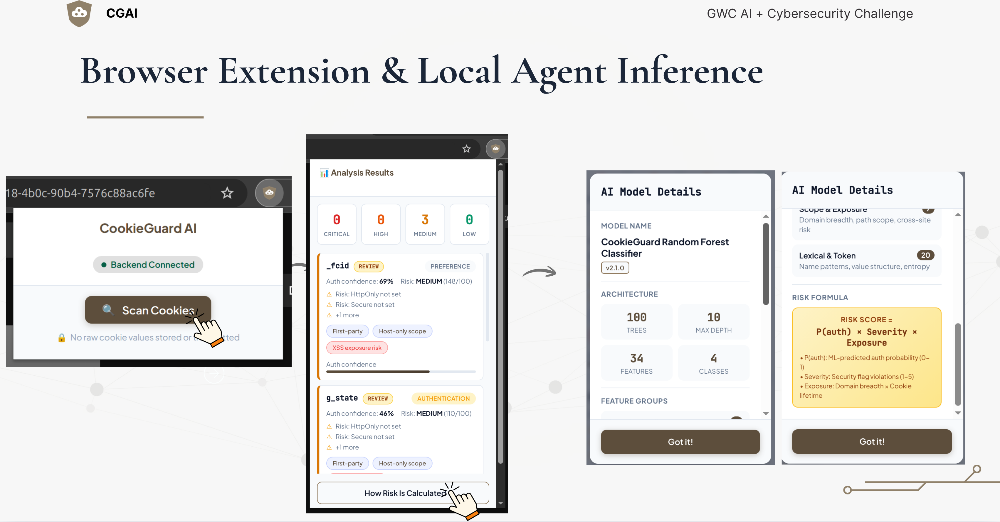

# CookieGuard AI

**Detecting Security-Critical Cookie Misuse That Puts Digital Identity at Risk**

An AI-powered web application that analyzes website cookies to detect security-related misuse that can lead to account takeover, unauthorized actions, and identity impersonation.

## Project Overview

CookieGuard AI uses machine learning and rule-based analysis to:
- Identify which cookies act as authentication tokens
- Score their security risk
- Explain in plain language how misconfigured cookies expose digital identity
##



## Project Architecture

### System Overview

```
┌─────────────────────────────────────────────────────────────────┐
│                        CookieGuard AI                           │
│                    End-to-End Architecture                      │
└─────────────────────────────────────────────────────────────────┘

  ┌──────────────┐
  │   Browser    │ ──→ Cookie Export (JSON)
  └──────────────┘
         │
         ▼
  ┌──────────────────────────────────────────────────────────────┐
  │                   Frontend (React)                           │
  │  • Upload Interface  • Results Visualization                 │
  │  • Risk Dashboard   • Report Export                          │
  └──────────────────────────────────────────────────────────────┘
         │ HTTP POST
         ▼
  ┌──────────────────────────────────────────────────────────────┐
  │                   Backend (Flask API)                        │
  │  • /api/analyze     • /api/demo                              │
  │  • /api/export      • /health                                │
  └──────────────────────────────────────────────────────────────┘
         │
         ▼
  ┌──────────────────────────────────────────────────────────────┐
  │              Analysis Pipeline (Python)                      │
  │                                                              │
  │  1. Feature Extraction                                       │
  │     ├─ Security flags (Secure, HttpOnly, SameSite)          │
  │     ├─ Expiry analysis                                       │
  │     ├─ Domain scope                                          │
  │     ├─ Name pattern matching                                 │
  │     └─ Entropy calculations                                  │
  │                                                              │
  │  2. ML Classification (Random Forest)                        │
  │     ├─ Input: 18 features                                    │
  │     ├─ Output: authentication/tracking/preference/other      │
  │     └─ Confidence scores                                     │
  │                                                              │
  │  3. Risk Scoring                                             │
  │     ├─ Security rule evaluation                              │
  │     ├─ Severity assignment (critical/high/medium/low/info)   │
  │     └─ Plain-language explanation generation                 │
  │                                                              │
  └──────────────────────────────────────────────────────────────┘
         │
         ▼
  ┌──────────────────────────────────────────────────────────────┐
  │                   Results & Reports                          │
  │  • Ranked security findings                                  │
  │  • Detailed issue explanations                               │
  │  • Actionable recommendations                                │
  │  • Downloadable security report                              │
  └──────────────────────────────────────────────────────────────┘
```

---

## Core Components

### 1. Feature Extractor (`feature_extractor.py`)

**Purpose:** Convert raw cookie metadata into ML-ready features.

**Input:** Cookie dictionary with attributes:
- name, domain, path
- secure, httpOnly, sameSite
- expirationDate
- value (optional)

**Output:** 18-dimensional feature vector:

| Feature | Type | Description |
|---------|------|-------------|
| has_secure | Binary | Secure flag present |
| has_httponly | Binary | HttpOnly flag present |
| has_samesite | Binary | SameSite attribute present |
| samesite_level | Ordinal | 0=None, 1=Lax, 2=Strict |
| is_session_cookie | Binary | No expiration date |
| expiry_days | Numeric | Days until expiration (capped at 365) |
| domain_is_wildcard | Binary | Domain starts with '.' |
| domain_depth | Numeric | Number of dots in domain |
| path_is_root | Binary | Path is '/' |
| name_matches_auth | Binary | Name matches auth patterns |
| name_matches_tracking | Binary | Name matches tracking patterns |
| name_matches_preference | Binary | Name matches preference patterns |
| name_entropy | Numeric | Shannon entropy of name |
| name_length | Numeric | Length of name |
| value_length | Numeric | Length of value |
| value_entropy | Numeric | Shannon entropy of value |
| value_looks_like_jwt | Binary | JWT-like structure |
| value_looks_like_hex | Binary | Hexadecimal pattern |

**Key Algorithms:**

1. **Pattern Matching:** Uses regex to identify common auth/tracking/preference cookie names
2. **Entropy Calculation:** Shannon entropy to measure randomness (high for tokens, low for preferences)
3. **Structural Analysis:** Detects JWT format, hex encoding, domain scope

---

### 2. ML Classifier (`classifier.py`)

**Purpose:** Predict cookie type using machine learning.

**Algorithm:** Random Forest Classifier
- **n_estimators:** 100 trees
- **max_depth:** 10
- **class_weight:** Balanced (handles class imbalance)

**Classes:**
- 0: other (functional cookies)
- 1: authentication (session/login tokens)
- 2: tracking (analytics cookies)
- 3: preference (user settings)

**Training Process:**
1. Load 800 labeled examples (synthetic data)
2. Normalize features with StandardScaler
3. Train Random Forest with balanced class weights
4. Calculate feature importance
5. Save trained model as pickle file

**Performance:**
- Training accuracy: ~100% (on synthetic data)
- Most important features: value_length, value_entropy, expiry_days

**Output:**
- Predicted class label
- Confidence score (0-1)
- Probability distribution across all classes

---

### 3. Risk Scorer (`risk_scorer.py`)

**Purpose:** Evaluate security risk and generate explanations.

**Risk Levels:**
- **CRITICAL** (50+ points): Immediate account takeover risk
- **HIGH** (30-49 points): Significant security exposure
- **MEDIUM** (15-29 points): Some security concerns
- **LOW** (1-14 points): Minor improvements possible
- **INFO** (0 points): No security concerns

**Security Rules for Authentication Cookies:**

| Vulnerability | Severity | Score | Impact |
|--------------|----------|-------|---------|
| Missing HttpOnly | CRITICAL | +40 | XSS-based session hijacking |
| Missing Secure | HIGH | +25 | Man-in-the-middle interception |
| Missing SameSite | HIGH | +20 | Cross-site request forgery |
| SameSite=Lax (not Strict) | MEDIUM | +5 | Limited CSRF risk |
| Long-lived (>30 days) | MEDIUM | +10 | Extended exposure window |
| Wildcard domain | MEDIUM | +15 | Subdomain-based theft |

**Output Structure:**
```json
{
  "cookie_name": "session_token",
  "ml_classification": {
    "type": "authentication",
    "confidence": 0.95
  },
  "risk_assessment": {
    "severity": "critical",
    "score": 75
  },
  "issues": [
    {
      "severity": "critical",
      "title": "Missing HttpOnly Flag",
      "description": "Plain-language explanation...",
      "impact": "Account takeover via session hijacking"
    }
  ],
  "recommendations": [
    "This cookie MUST have the HttpOnly flag set"
  ]
}
```

---

### 4. Training Data Generator (`generate_training_data.py`)

**Purpose:** Create realistic synthetic training data.

**Cookie Categories:**

**Authentication Cookies:**
- Names: session_id, JSESSIONID, auth_token, jwt_token
- Security: 90% Secure, 70% HttpOnly, often Lax/Strict
- Expiry: Session or short-lived (7-30 days)
- Values: JWT-like or hex tokens

**Tracking Cookies:**
- Names: _ga, _gid, fbp, DoubleClickId
- Security: 40% Secure, 10% HttpOnly, often missing SameSite
- Expiry: Long-lived (90-730 days)
- Values: Tracking IDs, timestamps

**Preference Cookies:**
- Names: language, theme, timezone, currency
- Security: 50% Secure, rarely HttpOnly
- Expiry: Medium to long-lived (90-365 days)
- Values: Simple strings (en-US, dark, UTC)

**Generation Strategy:**
- Balanced dataset: 200 samples per class
- Realistic variation in security configurations
- Intentional vulnerabilities to train detection
- Domain diversity (main domain, subdomains, wildcards)

## 🚀 Quick Start

### Prerequisites
- Python 3.8+
- Node.js 16+ (for frontend)
- pip and npm

### Installation

```bash
# Clone the repository
git clone https://github.com/yourusername/cookieguard-ai.git
cd cookieguard-ai

#If using conda
#conda create -n cookieguard python=3.10 -y
#conda activate cookieguard

# Install backend dependencies
pip install -r requirements.txt

# Train the ML model (first time only)
python backend/train_model.py

# Start the backend server
python backend/app.py

# In a new terminal, start the frontend
cd frontend
npm install
npm start
```

Visit `http://localhost:3000` to use CookieGuard AI.

## 📁 Project Structure

```
cookieguard-ai/
├── backend/
│   ├── app.py                 # Flask API server
│   ├── classifier.py          # ML cookie classifier
│   ├── risk_scorer.py         # Security risk analysis
│   ├── train_model.py         # Model training script
│   └── feature_extractor.py   # Cookie feature engineering
├── frontend/
│   ├── src/
│   │   ├── App.js            # Main React app
│   │   ├── CookieUpload.js   # Cookie import component
│   │   └── ResultsView.js    # Risk display component
│   └── package.json
├── data/
│   ├── training_cookies.csv   # Training dataset
│   └── demo_cookies.json      # Demo cookie examples
├── models/
│   └── cookie_classifier.pkl  # Trained ML model
└── docs/
    └── submission.pdf         # GWC Challenge submission
```

## 🔬 How It Works

1. **Data Collection**: Import cookies from browser (JSON export)
2. **Feature Extraction**: Analyze cookie attributes (flags, expiry, scope, name)
3. **ML Classification**: Predict cookie type (auth/tracking/preference) with confidence
4. **Risk Scoring**: Combine ML output with security rules
5. **Explanation**: Generate plain-language security report

## 🛡️ Threats Detected

- **Account Takeover** via session hijacking
- **Unauthorized Actions** (CSRF-style abuse)
- **Identity Exposure** across subdomains

## 💡 Why AI?

Without AI, users face 50+ cookies per site with no way to identify which ones are security-critical. CookieGuard AI's ML classifier:
- Distinguishes authentication cookies from tracking cookies
- Assigns confidence scores for prioritization
- Reduces false alarms through pattern learning

## 📊 Demo

Try the demo with pre-loaded cookie examples:
```bash
python backend/app.py --demo
```

## 🤝 Contributing

This project was created for the Girls Who Code AI Challenge 2025.

## 📄 License

MIT License - see LICENSE file for details
