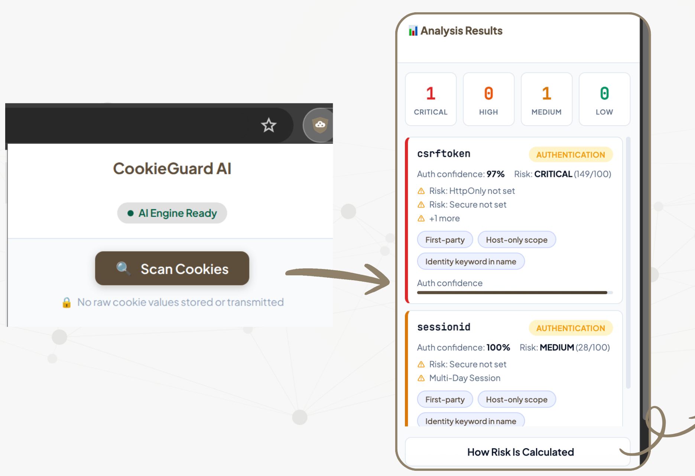

# CookieGuard AI

**Detecting Security-Critical Cookie Misuse That Puts Digital Identity at Risk**

An AI-powered Chrome extension that analyzes website cookies to detect security-related misuse that can lead to account takeover, unauthorized actions, and identity impersonation.

**Runs entirely in your browser — no backend, no servers, no data leaves your machine.**

## Project Overview

CookieGuard AI uses a RandomForest classifier (ONNX), rule-based risk scoring, and explainability to:
- Identify which cookies act as authentication tokens — including login-aware detection
- Score their security risk with a transparent, explainable formula
- Explain in plain language *why* the AI flagged each cookie and *what you can do about it*
- Simulate real attack paths (XSS, CSRF, subdomain takeover, network sniffing) per cookie



## What's New in 3.0

| Feature | v2.0 | v3.0 |
|---------|------|------|
| Architecture | Python backend required | **Self-contained Chrome extension** (ONNX Runtime Web) |
| Features | 38 | **38** (all ported to JS) |
| Models | 3 benchmarked (Python sklearn) | **ONNX Runtime Web** (in-browser inference) |
| Validation | Site-based group holdout | **Same** (model exported from v2.0 pipeline) |
| Explainability | Backend-computed | **Client-side** (engine.js) |
| Attack simulation | Backend-computed | **Client-side** (engine.js) |
| Privacy | Cookies sent to localhost | **Zero data leaves the browser** |
| Install | Python + pip + Flask | **Load unpacked in Chrome — done** |

---

## Quick Start (Self-Contained Extension)

The recommended way to run CookieGuard AI. No Python, no backend, no dependencies.

### Step 1: Download

**Option A — Clone via Git**
```bash
git clone git@github.com:aiscihub/cookieguard-ai.git
cd cookieguard-ai
```

**Option B — Download ZIP**
Go to the GitHub repository → Code → Download ZIP → Extract.

### Step 2: Load the Extension

1. Open Chrome and go to: `chrome://extensions/`
2. Toggle **Developer mode** (top-right corner)
3. Click **Load unpacked**
4. Select the `extension-standalone/` folder
5. Click Open

The extension icon appears in your toolbar.

### Step 3: Scan Cookies

1. Visit any website
2. Click the CookieGuard AI extension icon
3. Click **Scan Cookies**
4. Review classification, risk analysis, explainability, and attack simulation results

The status bar shows **"AI Engine Ready"** when the ONNX model is loaded, or **"Rule-Based Mode"** as a fallback.

### Extension Directory Structure

```
extension-standalone/
├── manifest.json              # Chrome MV3 manifest
├── popup.html                 # Extension UI
├── popup.js                   # UI logic (calls engine.js)
├── engine.js                  # Full analysis pipeline (JS port)
├── lib/
│   ├── ort.min.js             # ONNX Runtime Web
│   └── ort-wasm-simd.wasm     # WASM binary for inference
├── model/
│   ├── cookieguard_model.onnx # RandomForest (50 trees, 97.5% accuracy)
│   └── model_meta.json        # Class order + feature names
└── icons/
    ├── icon16.png
    ├── icon48.png
    └── icon128.png
```

---

## Backend Mode (For Debugging / Development)

The original Python backend is preserved for development, model retraining, and evaluation. It is **not required** for normal use.

<details>
<summary>Click to expand backend setup instructions</summary>

### Prerequisites
- Python 3.8+
- pip

### Setup

```bash
cd cookieguard-ai/backend

# Install dependencies
pip install -r requirements.txt

# Train the ML model (benchmarks 3 models)
python train_model.py

# Start the backend server
python app.py
```

The backend runs at `http://localhost:5000`.

### Using the Backend Extension

Load `cookieguardplugin/` (not `extension-standalone/`) in Chrome Developer Mode. This version connects to the Python backend for analysis.

### Backend Directory

```
backend/
├── app.py                    # Flask API server
├── classifier.py             # Multi-model classifier with benchmarking
├── risk_scorer.py            # Additive severity + exposure scoring
├── feature_extractor.py      # 38-feature extraction (4 groups)
├── explainability.py         # Per-cookie explanation engine
├── attack_simulator.py       # Attack path simulation
├── train_model.py            # Training pipeline with group holdout
├── evaluate_model.py         # Full evaluation suite (LOSO CV, bootstrap CI)
└── generate_training_data.py # Synthetic data generator
```

</details>

---

## Architecture

### Self-Contained Extension (Default)

```
┌──────────────┐       ┌────────────────────────────────────────────┐
│   Browser    │──────▶│          Chrome Extension (popup.js)       │
│              │       │                                            │
│ chrome.cookies API   │  engine.js — Full Analysis Pipeline        │
│              │       │  ┌──────────────────────────────────────┐  │
│              │       │  │ 1. Feature Extraction (38 features)  │  │
│              │       │  │ 2. ONNX Inference (RandomForest)     │  │
│              │       │  │    ↳ Rule-based fallback if WASM     │  │
│              │       │  │      unavailable                     │  │
│              │       │  │ 3. Risk Scoring (severity × exposure)│  │
│              │       │  │ 4. Explainability (signal extraction)│  │
│              │       │  │ 5. Attack Simulation (5 vectors)     │  │
│              │       │  └──────────────────────────────────────┘  │
│              │       │                                            │
│              │◀──────│  Results: classification, risk, signals,   │
│              │       │  attack paths, recommendations             │
└──────────────┘       └────────────────────────────────────────────┘
```

All computation happens in-browser. No network requests, no data exfiltration.

---

## Core Components

### 1. Feature Extractor — 38 features across 4 groups

| Group | Count | Features |
|-------|-------|----------|
| **Attributes** | 7 | has_secure, has_httponly, has_samesite, samesite_level, is_session_cookie, expiry_days, lifetime_category |
| **Scope** | 7 | domain_is_wildcard, domain_depth, etld_match, path_is_root, path_depth, cross_site_sendable, exposure_score |
| **Lexical** | 16 | name_matches_auth/tracking/preference, host/secure prefix, name_entropy, name_length, value_length, value_entropy_bucket, value_looks_like_jwt/hex/base64, value_has_padding, value_is_numeric, value_length_bucket |
| **Behavior** | 8 | f_changed_during_login, f_new_after_login, f_rotated_after_login, f_persistent_days_bucket, f_subdomain_shared, f_third_party_context, f_login_behavior_score, f_security_posture_score |

All 38 features are computed from `chrome.cookies` API output + basic string/math operations. No header inspection, no content scripts, no network monitoring required.

### 2. ML Classifier — ONNX Runtime Web

- **Model:** RandomForest (50 trees, depth 10) exported to ONNX with `zipmap=False`
- **Accuracy:** 97.5% on site-based holdout
- **Classes:** authentication, tracking, preference, other
- **Fallback:** Rule-based classifier when ONNX/WASM unavailable
- **Inference:** ~5ms per cookie on modern hardware

### 3. Risk Scorer

```
RiskScore = Σ(Severity Points) × Breadth × Lifetime
            [gated on P(auth) > 0.3]
```

| Vulnerability | Points | Impact |
|--------------|--------|--------|
| Missing HttpOnly | +40 | XSS session hijacking |
| Missing Secure | +25 | Network interception |
| Missing SameSite | +20 | CSRF attacks |
| Wildcard domain | +15 | Subdomain theft |
| Long-lived (>30d) | +10 | Extended exposure |

### 4. Explainability Engine

Per-cookie breakdown: classification signals (name pattern, entropy, login behavior), risk formula decomposition (severity points × breadth × lifetime), and plain-language interpretation.

### 5. Attack Simulator

Generates per-cookie attack paths based on actual security configuration:
- **XSS** — when HttpOnly is missing
- **CSRF** — when SameSite is unset
- **Network sniffing** — when Secure flag is missing
- **Subdomain takeover** — when domain is wildcarded
- **Session replay** — when cookie lifetime exceeds 30 days

Each path includes a user-actionable fix and a site-should-fix note.

---

## Evaluation (5,000 synthetic cookies · 22 sites · 40% hard samples)

| Metric | Value | 95% CI |
|--------|-------|--------|
| Accuracy | 95.7% | [93.2, 97.9] |
| Auth Recall | 95.7% | [90.0, 100.0] |
| Auth Precision | 90.4% | — |
| Auth FPR | 3.3% | [1.0, 6.0] |
| PR-AUC | 0.977 | [0.953, 0.994] |
| Top-3 Ranking | 100% | 5/5 sites |
| LOSO Generalization | 95.7% ± 2.10% | 22 folds |

Training data is synthetic — metrics represent performance on controlled data. Real-world results may vary.

---

## Project Structure

```
cookieguard-ai/
├── extension-standalone/          # ★ Self-contained extension (recommended)
│   ├── manifest.json
│   ├── popup.html / popup.js
│   ├── engine.js                  # Full pipeline (JS port)
│   ├── lib/                       # ONNX Runtime Web + WASM
│   └── model/                     # cookieguard_model.onnx
├── backend/                       # Python backend (debugging/development)
│   ├── app.py
│   ├── classifier.py
│   ├── risk_scorer.py
│   ├── feature_extractor.py
│   ├── explainability.py
│   ├── attack_simulator.py
│   ├── evaluate_model.py
│   ├── train_model.py
│   └── generate_training_data.py
├── cookieguardplugin/             # Backend-dependent extension (legacy)
│   ├── manifest.json
│   ├── popup.html
│   └── popup.js
├── models/                        # Trained model artifacts
│   ├── cookie_classifier.pkl
│   ├── model_card.json
│   ├── feature_schema.json
│   └── benchmark_results.csv
└── resource/
    └── *.png
```

## Known Limitations

- Training data is synthetic — metrics represent an upper bound on controlled data
- Behavior features require Login Flow capture mode; default to zero otherwise
- Attack simulation is rule-based (potential paths, not confirmed vulnerabilities)
- ONNX model is ~1MB, WASM runtime is ~11MB (total extension ~12MB)

## License

MIT License — see LICENSE file for details